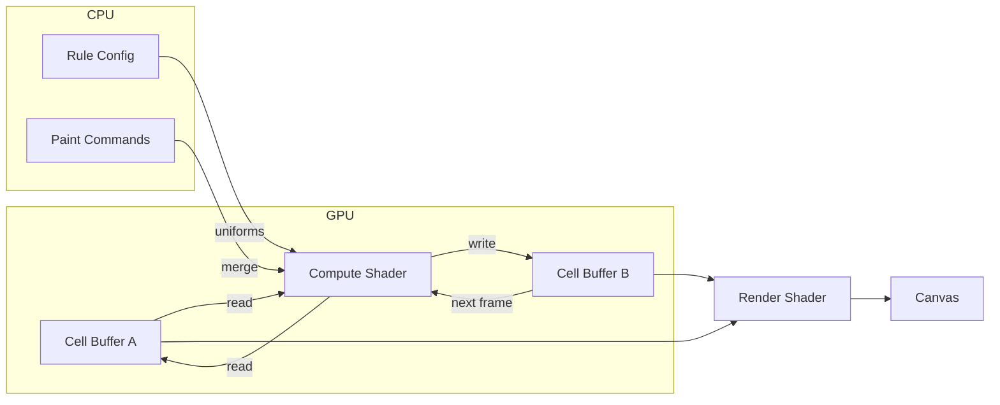

# Games of Life

A WebGPU-powered cellular automaton simulator. Runs entirely on the GPU for smooth performance even on large grids.

**[Live Demo →](https://neovand.github.io/games-of-life/)**


## How It Works

The simulation runs as a compute shader on the GPU. Each frame, the shader reads the current grid state, applies the cellular automaton rules in parallel across all cells, and writes to a second buffer. The buffers swap each frame (double buffering).



### Rule Encoding

Rules are encoded as bitmasks for fast GPU lookup:

```
B3/S23 (Conway's Life)
├── Birth mask:   0b000001000  (bit 3 set → birth with 3 neighbors)
└── Survive mask: 0b000001100  (bits 2,3 set → survive with 2 or 3)
```

The compute shader checks neighbors and uses bitwise AND to determine the next state—no branching required.

### Multi-State Support

Beyond binary Life-like rules, the simulator supports Generations rules (e.g., Brian's Brain). Cells transition through N states before dying, creating trail effects:

```
State 0 (dead) ← State N-1 ← ... ← State 2 ← State 1 (alive)
                    ↑__________________________|
                         (only if birth condition met)
```

## Tech Stack

- **WebGPU** — Compute shaders for simulation, render shaders for visualization
- **Svelte 5** — Reactive UI with runes (`$state`, `$derived`, `$effect`)
- **SvelteKit** — Static site generation via `adapter-static`
- **TypeScript** — Type-safe GPU buffer management
- **WGSL** — WebGPU Shading Language for both compute and fragment shaders

## Project Structure

```
src/lib/
├── webgpu/
│   ├── context.ts        # Device initialization, capability detection
│   ├── simulation.ts     # Compute pipeline, double buffering, painting
│   └── shaders/
│       ├── life-compute.wgsl   # CA rules, neighbor counting
│       └── life-render.wgsl    # Zoom/pan, grid lines, coloring
├── components/
│   ├── Canvas.svelte     # WebGPU canvas, mouse/keyboard handling
│   ├── Controls.svelte   # Toolbar with play/pause, speed, brush
│   ├── RuleEditor.svelte # Birth/survive checkboxes, presets
│   └── ...
└── stores/
    └── simulation.svelte.ts  # Reactive state management
```

## Running Locally

```bash
npm install
npm run dev
```

Requires a browser with WebGPU support (Chrome 113+, Edge 113+, or Firefox Nightly with flags).

## Controls

| Key | Action |
|-----|--------|
| `Space` | Play/Pause |
| `Click` / `Right-click` | Draw / Erase |
| `Scroll` | Zoom |
| `Shift+Drag` | Pan |
| `E` | Edit rules |
| `I` | Initialize grid |
| `R` | Reinitialize |
| `[ ]` | Brush size |
| `, .` | Speed |

## License

MIT
